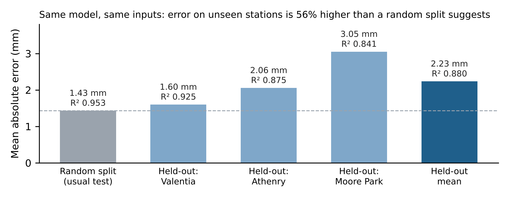

# Soil moisture deficit at new sites: random split vs. station-held-out testing

Independent research study by **Vignesh Gunnala** (MSc Data Analytics, TUS Limerick), 2026.

Soil-moisture and irrigation models are usually tested on a random split of days. Because soil
moisture deficit (SMD) changes slowly (lag-1 autocorrelation ≈ 0.98), test days sit next to
training days from the same place, so the reported accuracy says little about performance at a
site the model has never seen. This repository measures that gap on Irish data.

## Data

Met Éireann daily records from three synoptic stations, 2015–2023, **9,847 station-days**
after removing days with missing values.

| Station | ID | County | Character |
|---|---|---|---|
| Valentia Observatory | 2275 | Kerry | Wet Atlantic maritime |
| Athenry | 1875 | Galway | Western inland (Teagasc research centre) |
| Moore Park | 575 | Cork | Southern inland (Teagasc research farm) |

- **Target:** `smd_wd`, Met Éireann's operational soil moisture deficit for well-drained soils (mm).
- **Weather-only inputs (24 features):** rainfall, temperature and wind, with their 3–30 day
  accumulations and means, dry-day counts, days since rain, station coordinates and day of year.
- **Full-instrumentation inputs (31 features):** the above plus potential evapotranspiration,
  evaporation, global radiation and soil temperature.
- **No lagged or autoregressive form of the target is used as an input.**

Source: Met Éireann historical daily data, licensed under
[CC BY 4.0](https://creativecommons.org/licenses/by/4.0/). The files in `data/` are unmodified
station downloads.

## Method

Random Forest (60 trees, min leaf 3, max depth 16, fixed seed), identical across all runs; no
tuning on held-out data. Three test designs:

1. **Random 3-fold split**: the usual approach, reported only to show how optimistic it is.
2. **Leave-one-station-out**: train on two stations, test on the third.
3. **Leave-one-year-out**: train on eight years, test on the ninth.

Baselines: day-of-year climatology and a conventional water-balance (bucket) model.

## Results (weather-only model)

| Test | R² | MAE (mm) | RMSE (mm) |
|---|---|---|---|
| Random 3-fold split | 0.953 | 1.43 | 3.01 |
| Hold out Athenry | 0.875 | 2.06 | 4.56 |
| Hold out Valentia | 0.925 | 1.60 | 3.25 |
| Hold out Moore Park | 0.841 | 3.05 | 6.45 |
| **Station-held-out mean** | **0.880** | **2.23** | **4.75** |

- On unseen stations, MAE is **56% higher** (RMSE 58% higher) than the random split suggests.
- Weather-only inputs come within **0.33 mm MAE** of the full-instrumentation model (held-out mean R² 0.907).
- Both baselines are clearly beaten on held-out stations: water balance mean R² 0.644, climatology 0.322.
- Leave-one-year-out mean R² is 0.878 (weather-only).
- Permutation importance: day of year ≈ 70%, 30-day rainfall ≈ 21%, same-day rainfall < 1%.
- **Main weakness:** the 2018 drought at withheld Moore Park (R² 0.745, MAE 6.90 mm). The model
  underestimates extreme deficits, which is exactly when irrigation decisions matter most.



## Reproduce

```bash
pip install -r requirements.txt
python code/smd_pipeline.py --data-dir data --out-dir output   # all protocols, baselines, importance
python code/make_summary.py --data-dir data --out-dir output   # summary table with RMSE, 2018 check, figure
```

Runtime is about 2–3 minutes on a laptop. Small differences in the third decimal place can occur
across library versions.

## Outputs

| File | Content |
|---|---|
| `output/results_main.csv` | Random split and station-held-out results, all models and baselines |
| `output/results_year.csv` | Leave-one-year-out results by year |
| `output/importance.csv` | Permutation importance (weather-only model, Moore Park withheld) |
| `output/summary_random_vs_heldout.csv` | R², MAE and RMSE for random vs held-out testing |
| `output/fig_random_vs_heldout.png` | Headline figure |

## Limitations

Three stations is a limited test of spatial transfer; only the well-drained soil class is
modelled; and Met Éireann's SMD is itself a model output, not a field measurement.

## Status

Manuscript in preparation.

## Contact

Vignesh Gunnala · vigneshgunnala440@gmail.com · [LinkedIn](https://linkedin.com/in/vignesh-gunnala-5547711b4/)
